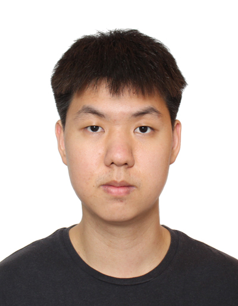

We are a team based in the [School of Computing, National University of Singapore](https://www.comp.nus.edu.sg).

You can reach us at the email `e1357170@u.nus.edu`

## Project team

### Nguyen The Bach

[[github](https://github.com/djgmh9)]
[[portfolio](team/djgmh9.md)]

* Role: Team Lead
* Responsibilities: coordination, design, feature development, and documentation

### Trinh Hoang Hai

[[github](http://github.com/hai0506)]
[[portfolio](team/hai0506.md)]

* Role: Developer
* Responsibilities: design, feature development and documentation

### Kan Rui Xian Matthew

[[github](https://github.com/krxm107)] [[portfolio](team/krxm107.md)]

* Role: Developer
* Responsibilities: design, feature development and documentation

### Chen Ziming

[[github](http://github.com/Zmzzz3)]
[[portfolio](team/zmzzz3.md)]

* Role: Developer
* Responsibilities: design, feature development and documentation

### Yen Jun Jie Richard

[[github](http://github.com/yjjr0)]
[[portfolio](team/yjjr0.md)]

* Role: Developer
* Responsibilities: design, feature development and documentation
