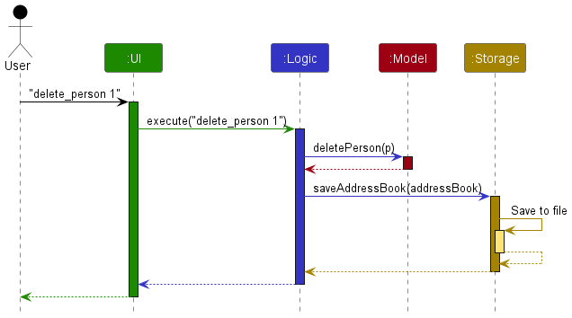
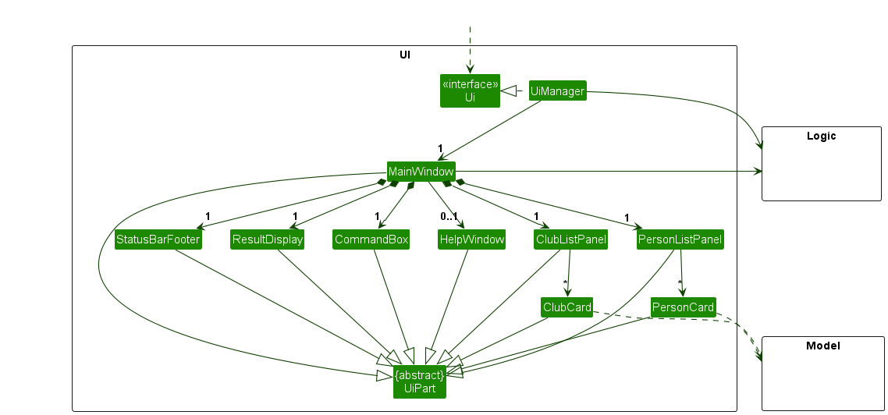
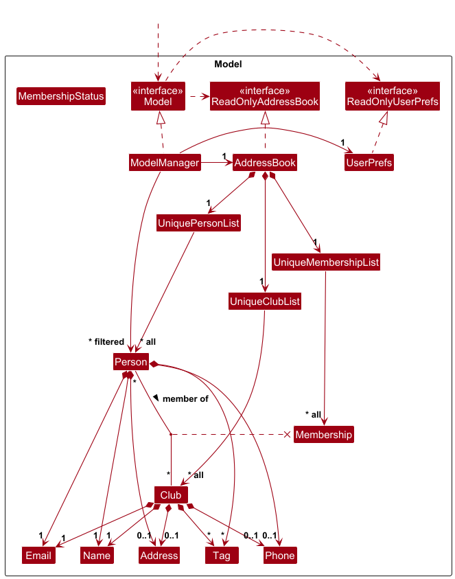
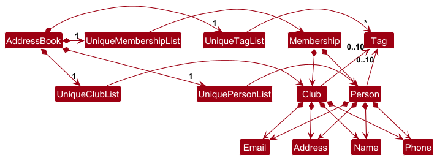
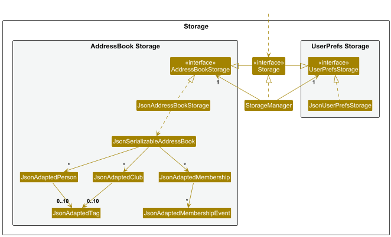

* Table of Contents
{:toc}

--------------------------------------------------------------------------------------------------------------------

## **Acknowledgements**

* {list here sources of all reused/adapted ideas, code, documentation, and third-party libraries -- include links to the original source as well}

--------------------------------------------------------------------------------------------------------------------

## **Setting up, getting started**

Refer to the guide [_Setting up and getting started_](SettingUp.md).

--------------------------------------------------------------------------------------------------------------------

## **Design**

:bulb: **Tip:** The `.puml` files used to create diagrams are in this document `docs/diagrams` folder. Refer to the [_PlantUML Tutorial_ at se-edu/guides](https://se-education.org/guides/tutorials/plantUml.html) to learn how to create and edit diagrams.

### Architecture

The ***Architecture Diagram*** given above explains the high-level design of the App.

Given below is a quick overview of main components and how they interact with each other.

**Main components of the architecture**

**`Main`** (consisting of classes [`Main`](https://github.com/AY2526S1-CS2103T-F15b-4/tp/blob/master/src/main/java/seedu/address/Main.java) and [`MainApp`](https://github.com/AY2526S1-CS2103T-F15b-4/tp/blob/master/src/main/java/seedu/address/MainApp.java)) is in charge of the app launch and shut down.
* At app launch, it initializes the other components in the correct sequence, and connects them up with each other.
* At shut down, it shuts down the other components and invokes cleanup methods where necessary.

The bulk of the app's work is done by the following four components:

* [**`UI`**](#ui-component): The UI of the App.
* [**`Logic`**](#logic-component): The command executor.
* [**`Model`**](#model-component): Holds the data of the App in memory.
* [**`Storage`**](#storage-component): Reads data from, and writes data to, the hard disk.

[**`Commons`**](#common-classes) represents a collection of classes used by multiple other components.

**How the architecture components interact with each other**

The *Sequence Diagram* below shows how the components interact with each other for the scenario where the user issues the command `delete 1`.

Each of the four main components (also shown in the diagram above),

* defines its *API* in an `interface` with the same name as the Component.
* implements its functionality using a concrete `{Component Name}Manager` class (which follows the corresponding API `interface` mentioned in the previous point.

For example, the `Logic` component defines its API in the `Logic.java` interface and implements its functionality using the `LogicManager.java` class which follows the `Logic` interface. Other components interact with a given component through its interface rather than the concrete class (reason: to prevent outside component's being coupled to the implementation of a component), as illustrated in the (partial) class diagram below.

The sections below give more details of each component.

### UI component

The **API** of this component is specified in [`Ui.java`](https://github.com/se-edu/addressbook-level3/tree/master/src/main/java/seedu/address/ui/Ui.java)

The UI consists of a `MainWindow` that is made up of parts e.g.`CommandBox`, `ResultDisplay`, `PersonListPanel`, `StatusBarFooter` etc. All these, including the `MainWindow`, inherit from the abstract `UiPart` class which captures the commonalities between classes that represent parts of the visible GUI.

The `UI` component uses the JavaFx UI framework. The layout of these UI parts are defined in matching `.fxml` files that are in the `src/main/resources/view` folder. For example, the layout of the [`MainWindow`](https://github.com/se-edu/addressbook-level3/tree/master/src/main/java/seedu/address/ui/MainWindow.java) is specified in [`MainWindow.fxml`](https://github.com/se-edu/addressbook-level3/tree/master/src/main/resources/view/MainWindow.fxml)

The `UI` component,

* executes user commands using the `Logic` component.
* listens for changes to `Model` data so that the UI can be updated with the modified data.
* keeps a reference to the `Logic` component, because the `UI` relies on the `Logic` to execute commands.
* depends on some classes in the `Model` component, as it displays `Person` object residing in the `Model`.

### Logic component

**API** : [`Logic.java`](https://github.com/se-edu/addressbook-level3/tree/master/src/main/java/seedu/address/logic/Logic.java)

Here's a (partial) class diagram of the `Logic` component:

The sequence diagram below illustrates the interactions within the `Logic` component, taking `execute("delete_person 1")` API call as an example.

:information_source: **Note:** The lifeline for `DeleteCommandParser` should end at the destroy marker (X) but due to a limitation of PlantUML, the lifeline continues till the end of diagram.

How the `Logic` component works:

1. When `Logic` is called upon to execute a command, it is passed to an `AddressBookParser` object which in turn creates a parser that matches the command (e.g., `DeletePersonCommandParser`) and uses it to parse the command.
1. This results in a `Command` object (more precisely, an object of one of its subclasses e.g., `DeletePersonCommand`) which is executed by the `LogicManager`.
1. The command can communicate with the `Model` when it is executed (e.g. to delete a person). 
   Note that although this is shown as a single step in the diagram above (for simplicity), in the code it can take several interactions (between the command object and the `Model`) to achieve.
1. The result of the command execution is encapsulated as a `CommandResult` object which is returned back from `Logic`.

Here are the other classes in `Logic` (omitted from the class diagram above) that are used for parsing a user command:

How the parsing works:
* When called upon to parse a user command, the `AddressBookParser` class creates an `XYZCommandParser` (`XYZ` is a placeholder for the specific command name e.g., `AddPersonCommandParser`) which uses the other classes shown above to parse the user command and create a `XYZCommand` object (e.g., `AddPersonCommand`) which the `AddressBookParser` returns back as a `Command` object.
* All `XYZCommandParser` classes (e.g., `AddPersonCommandParser`, `DeletePersonCommandParser`, ...) inherit from the `Parser` interface so that they can be treated similarly where possible e.g, during testing.

### Model component
**API** : [`Model.java`](https://github.com/se-edu/addressbook-level3/tree/master/src/main/java/seedu/address/model/Model.java)

The `Model` component,

* stores the address book data i.e., all `Person` objects (which are contained in a `UniquePersonList` object).
* stores the currently 'selected' `Person` objects (e.g., results of a search query) as a separate _filtered_ list which is exposed to outsiders as an unmodifiable `ObservableList<Person>` that can be 'observed' e.g. the UI can be bound to this list so that the UI automatically updates when the data in the list change.
* stores `Club` and `Membership` in a similar manner as `Person`
* stores a `UserPref` object that represents the user’s preferences. This is exposed to the outside as a `ReadOnlyUserPref` objects.
* does not depend on any of the other three components (as the `Model` represents data entities of the domain, they should make sense on their own without depending on other components)

:information_source: **Note:** An alternative (arguably, a more OOP) model is given below. It has a `Tag` list in the `AddressBook`, which `Person` references. This allows `AddressBook` to only require one `Tag` object per unique tag, instead of each `Person` needing their own `Tag` objects. 

### Storage component

**API** : [`Storage.java`](https://github.com/se-edu/addressbook-level3/tree/master/src/main/java/seedu/address/storage/Storage.java)

The `Storage` component,
* can save both address book data and user preference data in JSON format, and read them back into corresponding objects.
* inherits from both `AddressBookStorage` and `UserPrefStorage`, which means it can be treated as either one (if only the functionality of only one is needed).
* depends on some classes in the `Model` component (because the `Storage` component's job is to save/retrieve objects that belong to the `Model`)

### Common classes

Classes used by multiple components are in the `seedu.address.commons` package.

--------------------------------------------------------------------------------------------------------------------

## **Implementation**

This section describes some noteworthy details on how certain features are implemented.

### \[Proposed\] Undo/redo feature

#### Proposed Implementation

The proposed undo/redo mechanism is facilitated by `VersionedAddressBook`. It extends `AddressBook` with an undo/redo history, stored internally as an `addressBookStateList` and `currentStatePointer`. Additionally, it implements the following operations:

* `VersionedAddressBook#commit()` — Saves the current address book state in its history.
* `VersionedAddressBook#undo()` — Restores the previous address book state from its history.
* `VersionedAddressBook#redo()` — Restores a previously undone address book state from its history.

These operations are exposed in the `Model` interface as `Model#commitAddressBook()`, `Model#undoAddressBook()` and `Model#redoAddressBook()` respectively.

Given below is an example usage scenario and how the undo/redo mechanism behaves at each step.

Step 1. The user launches the application for the first time. The `VersionedAddressBook` will be initialized with the initial address book state, and the `currentStatePointer` pointing to that single address book state.

Step 2. The user executes `delete 5` command to delete the 5th person in the address book. The `delete` command calls `Model#commitAddressBook()`, causing the modified state of the address book after the `delete 5` command executes to be saved in the `addressBookStateList`, and the `currentStatePointer` is shifted to the newly inserted address book state.

Step 3. The user executes `add_person n/David …​` to add a new person. The `add_person` command also calls `Model#commitAddressBook()`, causing another modified address book state to be saved into the `addressBookStateList`.

:information_source: **Note:** If a command fails its execution, it will not call `Model#commitAddressBook()`, so the address book state will not be saved into the `addressBookStateList`.

Step 4. The user now decides that adding the person was a mistake, and decides to undo that action by executing the `undo` command. The `undo` command will call `Model#undoAddressBook()`, which will shift the `currentStatePointer` once to the left, pointing it to the previous address book state, and restores the address book to that state.

:information_source: **Note:** If the `currentStatePointer` is at index 0, pointing to the initial AddressBook state, then there are no previous AddressBook states to restore. The `undo` command uses `Model#canUndoAddressBook()` to check if this is the case. If so, it will return an error to the user rather
than attempting to perform the undo.

The following sequence diagram shows how an undo operation goes through the `Logic` component:

:information_source: **Note:** The lifeline for `UndoCommand` should end at the destroy marker (X) but due to a limitation of PlantUML, the lifeline reaches the end of diagram.

Similarly, how an undo operation goes through the `Model` component is shown below:

The `redo` command does the opposite — it calls `Model#redoAddressBook()`, which shifts the `currentStatePointer` once to the right, pointing to the previously undone state, and restores the address book to that state.

:information_source: **Note:** If the `currentStatePointer` is at index `addressBookStateList.size() - 1`, pointing to the latest address book state, then there are no undone AddressBook states to restore. The `redo` command uses `Model#canRedoAddressBook()` to check if this is the case. If so, it will return an error to the user rather than attempting to perform the redo.

Step 5. The user then decides to execute the command `list`. Commands that do not modify the address book, such as `list`, will usually not call `Model#commitAddressBook()`, `Model#undoAddressBook()` or `Model#redoAddressBook()`. Thus, the `addressBookStateList` remains unchanged.

Step 6. The user executes `clear`, which calls `Model#commitAddressBook()`. Since the `currentStatePointer` is not pointing at the end of the `addressBookStateList`, all address book states after the `currentStatePointer` will be purged. Reason: It no longer makes sense to redo the `add_person n/David …​` command. This is the behavior that most modern desktop applications follow.

The following activity diagram summarizes what happens when a user executes a new command:

#### Design considerations:

**Aspect: How undo & redo executes:**

* **Alternative 1 (current choice):** Saves the entire address book.
  * Pros: Easy to implement.
  * Cons: May have performance issues in terms of memory usage.

* **Alternative 2:** Individual command knows how to undo/redo by
  itself.
  * Pros: Will use less memory (e.g. for `delete`, just save the person being deleted).
  * Cons: We must ensure that the implementation of each individual command are correct.

_{more aspects and alternatives to be added}_

### \[Proposed\] Data archiving

_{Explain here how the data archiving feature will be implemented}_

--------------------------------------------------------------------------------------------------------------------

## **Documentation, logging, testing, configuration, dev-ops**

* [Documentation guide](Documentation.md)
* [Testing guide](Testing.md)
* [Logging guide](Logging.md)
* [Configuration guide](Configuration.md)
* [DevOps guide](DevOps.md)

--------------------------------------------------------------------------------------------------------------------

## **Appendix: Requirements**

### Product scope

**Target user profile**:

* manages multiple clubs
* has a need to manage a significant number of persons
* want to keep track of their members' membership expiry date and history
* prefer desktop apps over other types
* can type fast
* prefers typing to mouse interactions
* is reasonably comfortable using CLI apps

**Value proposition**:
manage multiple clubs & clubs' persons faster than a typical mouse/GUI driven app

### User stories

Priorities: High (must have) - `***`, Medium (nice to have / good to have) - `**`, Low (optional / unlikely to have) - `*`

### User Stories

| #  | As a …                           | I can …                                                  | So that I can …                                                             | Notes |
|----|----------------------------------|----------------------------------------------------------|-----------------------------------------------------------------------------|-------|
| 1  | potential user exploring the app | see the app populated with sample data                   | easily see how the app will look like when it is in use                     | ***   |
| 2  | user                             | add persons                                              | add person details of fellow members                                        | ***   |
| 3  | user                             | search for persons                                       | quickly locate them from their information                                  | ***   |
| 4  | user                             | edit persons                                             | update person details of members when the members change their phone number | ***   |
| 5  | user                             | delete persons                                           | remove person details of members who have left the club                     | ***   |
| 6  | user                             | add multiple phone numbers                               | add all the person’s different phone numbers e.g. mobile, home, office      | **    |
| 7  | user                             | download the address book data from a file               | forward the address book file to members in the management committee        | *     |
| 8  | user                             | import address book data from a file                     | easily get the data that someone sent me into my app                        | *     |
| 9  | user                             | add notes to a person                                    | record extra details about the person                                       | **    |
| 10 | user                             | view a person’s full profile in a screen                 | easily see all the info about a person                                      | **    |
| 11 | user                             | create a club with management                            | group members together                                                      | ***   |
| 12 | user                             | assign a person to multiple clubs                        | know which clubs they belong to                                             | ***   |
| 13 | user                             | view all members of a club                               | get the full list of members of a club                                      | ***   |
| 14 | user                             | edit a club                                              | update club details                                                         | ***   |
| 15 | user                             | delete a club                                            | remove clubs that no longer exist                                           | ***   |
| 16 | user                             | record when someone joined a club                        | track how long they have been in the club                                   | **    |
| 17 | user                             | search for a club by name                                | look up a club quickly                                                      | ***   |
| 18 | user                             | add more club info such as descriptions, timings, venues | keep track of what each club does and when and where the club takes place   | **    |
| 19 | user                             | tag a person as a club committee member                  | know that this person is a committee member of a certain club               | **    |
| 20 | user                             | view all committee members of a club                     | quickly find their information when I need to person them about their clubs | **    |
| 21 | user                             | sort persons by name                                     | view my persons in an order that is intuitive                               | **    |
| 22 | user                             | sort club members by join date                           | see new and old members more easily                                         | **    |
| 23 | user                             | delete multiple persons at once                          | delete faster                                                               | **    |
| 24 | user                             | create a profile photo for persons                       | easily identify people, even if they share names                            | **    |
| 25 | user                             | bookmark or save important persons                       | easily access them                                                          | **    |
| 26 | user                             | quickly copy a person to my clipboard                    | more quickly access persons                                                 | **    |
| 27 | user                             | create events and tag persons                            | attach person details to real world club events                             | **    |
| 28 | user                             | tag multiple persons at once                             | speed up tagging                                                            | **    |
| 29 | user                             | search by multiple fields at once                        | more precisely find persons                                                 | **    |
| 30 | user                             | undo my last action                                      | easily go back on my mistakes                                               | **    |
| 31 | user                             | add membership | track who belongs to which club | ***    |
| 32 | user                             | delete membership | remove a member from a group | ***    |
| 33 | user                             | renew membership | extend an active membership duration | ***    |
| 34 | user                             | cancel membership | cancel a membership | ***    |
| 35 | user                             | reactivate membership | reactivate an expired, pending cancellation or cancelled membership | ***    |
| 36 | user                             | get membership history | to improve business strategy | **    |

### Use cases

(For all use cases below, the **System** is the `ClubHub` and the **Actor** is the `user`, unless specified otherwise)

#### **Use case: Delete a person**

**Scope:** The user wants to remove a person from the contact book. The `delete_person` command allows deletion by the person's name.

**MSS**

1.  The user requests to list persons using the `list_persons` command to find the name of the person to be deleted.
2.  The contact book app displays a list of all persons.
3.  The user issues the `delete_person INDEX` command with the index of an existing person.
4.  The contact book app deletes the person from the system and all associated clubs, displaying a confirmation message: "person deleted: <NAME>; Phone: <PHONE_NUMBER>; Email: <EMAIL>".

    Use case ends.

**Extensions**

*   2a. The person list is empty.
    *   2a1. The contact book app shows the message: "You do not have any persons saved."
        Use case ends.
*   3a. The person name provided does not exist in the contact book.
    *   3a1. The contact book app shows an error message: "person not found".
        Use case resumes at step 1.
*   3b. The user provides an invalid command format.
    *   3b1. The contact book app shows an error message: "Invalid command format. Usage: `del_person NAME`".
        Use case resumes at step 1.

#### **Use case: Add a new person**

**Scope:** The user wants to add a new person to the address book.

**MSS**

1.  The user issues the command `add_person n/NAME p/PHONE_NUMBER e/EMAIL a/ADDRESS t/TAG1 t/TAG2 ...`. Note that there can be any number of tags, including 0.
2.  The app creates the new person, then displays a success message: "New person added: NAME; Phone: PHONE_NUMBER; Email: EMAIL; Address: ADDRESS; Tags: \[TAG1\]\[TAG2\]...".

    Use case ends.

**Extensions**

*   2a. A person with the same name already exists in the address book.
    *   2a1. The contact book app shows a relevant error message, such as "This person already exists in the address book"
        Use case ends.
*   2b. One of the provided fields is invalid (e.g., name is too long, phone number has non-digit characters, or email format is incorrect).
    *   2b1. The contact book app shows the corresponding error message for the invalid parameter (e.g., "Name too long (70 characters)").
        Use case ends.
*   2c. The user provides an invalid command format.
    *   2c1. The contact book app shows an error message: (e.g. "Invalid command format. Usage: `add_person n/NAME p/PHONE_NUMBER e/EMAIL a/address t/TAG1 t/TAG2 ...`").
        Use case ends.

#### **Use case: Add a new club**

**Scope:** The user wants to create a new club in the address book.

**MSS**

1.  The user issues the `add_club n/NAME p/PHONE_NUMBER e/EMAIL a/ADDRESS t/TAG1 t/TAG2 ...` command with a valid and unique club name. Note that there can be any number of tags, including 0.
2.  The address book app creates the new club and displays a success message: "New club added: NAME; Phone: PHONE_NUMBER; Email: EMAIL; Address: ADDRESS; Tags: \[TAG1\]\[TAG2\]...".

    Use case ends.

**Extensions**

*   2a. The specified club name already exists in the address book.
    *   2a1. The contact book app shows an error message (e.g "This club already exists in the address book")
        Use case ends.
*   2b. The provided club name is invalid (e.g., it is blank)
    *   2b1. The contact book app shows the relevant error message (e.g., "Name cannot be blank").
        Use case ends.
*   2c. The command format is invalid.
    *   2c1. The contact book app shows an error message: "Invalid command format. Usage: `add_club n/NAME p/PHONE_NUMBER e/EMAIL a/ADDRESS t/TAG1 t/TAG2 ...`".
        Use case ends.

#### **Use case: Delete a club**

**Scope:** The user wants to delete an existing club from the contact book.

**MSS**

1.  The user requests to list all clubs using the `list_clubs` command.
2.  The contact book app displays a list of all existing clubs.
3.  The user issues the `delete_club INDEX` command with the index of a club from the list.
4.  The contact book app deletes the specified club and shows a success message: "Club deleted: <NAME>".

    Use case ends.

**Extensions**

*   2a. The list of clubs is empty.
    *   2a1. The contact book app shows an error message: "You do not have any clubs saved."
        Use case ends.
*   3a. The specified club name does not exist.
    *   3a1. The contact book app shows an error message: "Club not found".
        Use case resumes at step 1.
*   3b. The command format is invalid.
    *   3b1. The contact book app shows an error message: "Invalid command format. Usage: `del_club CLUB_NAME`".
        Use case resumes at step 1.

### Non-Functional Requirements

1. Should work on any _mainstream OS_ as long as it has Java `17` or above installed.
2. Should be able to hold up to 1000 persons and 100 clubs without a noticeable sluggishness in performance for typical usage.
3. A user with above average typing speed for regular English text (i.e. not code, not system admin commands) should be able to accomplish most of the tasks faster using commands than using the mouse.
4. The software should work without requiring an installer.
5. The GUI should work well (i.e., should not cause any resolution-related inconveniences to the user) for standard screen resolutions 1920x1080 and higher and for screen scales 100% and 125%. In addition, the GUI should be usable (i.e., all functions can be used even if the user experience is not optimal) for resolutions 1280x720 and higher and for screen scales 150%.
6. Text and other UI elements should not overflow if too long and should still be displayed properly in full, perhaps in a scroll view.
7. Every command failures should display an appropriate error message.
8. Error messages should be clear, specific, and give suggestions on how to fix the error.
9. Loading and saving to file should be fast, user should not see a noticeable freeze.
10. Loading and saving to file should never crash, even if file is corrupted/invalid.
11. Application should never corrupt save file.
12. Data should be saved up to the latest action even if the app is not exited conventionally.
13. Save file should not be encrypted and should be in a human editable text file.
14. Command syntax should be consistent and predictable, especially between commands for persons and commands for clubs.
15. The application should be optimized to run smoothly on _standard hardware._
16. The application size should be less than 100MB to facilitate easy distribution and storage.
17. The application does not need to support multi-user operations.

### Glossary

* **CLI**: Command Line Interface, a text-only interface for using the program
* **(G)UI**: (Graphical) User Interface, a visual interface for using the program, with elements like menus and buttons
* **Club**: Association of people, minimally requires a name, description and owner
* **Command**: Text instruction for using the program via CLI
* **Mainstream OS**: Windows, Linux, Unix, MacOS that is up to date (version within the past year)
* **Standard hardware**: Any modern, store-bought laptop or personal computer (not including mobile devices)
* **Private person detail**: A person detail that is not meant to be shared with others

--------------------------------------------------------------------------------------------------------------------

## **Appendix: Instructions for manual testing**

Given below are instructions to test the app manually.

:information_source: **Note:** These instructions only provide a starting point for testers to work on;
testers are expected to do more *exploratory* testing.

### Launch and shutdown

1. Initial launch

   1. Download the jar file and copy into an empty folder

   2. Double-click the jar file.  Expected: Shows the GUI with a set of sample persons and clubs. The window size may not be optimum.

2. Saving window preferences

   1. Resize the window to an optimum size. Move the window to a different location. Close the window.

   2. Re-launch the app by double-clicking the jar file. 
       Expected: The most recent window size and location is retained.
    
### Clearing sample data

1. Test case: `clear`   Expected: A warning message is displayed, prompting the user to enter `clear YES` to confirm the clear.
    
2. Test case: `clear YES`   Expected: All data is cleared from the app.
    
    
### Adding persons and clubs
    
Prerequisites: None

1. Adding a person   Test case: `add_person n/John Doe e/john@example.com p/91234567 a/123 Clementi Rd`  Expected: A new person is created in the list. Details of the created person shown in the status message. 

2. Adding an invalid person   Test case: `add_person e/alex@example.com t/friend`   Expected: No new person is created as named not provided. Error message is displayed to the user.
    
3. Adding a club   Test case: `add_club n/Basketball e/basket@example.com p/98765432`   Expected: A new club is created in the list. Details of the created club shown in the status message. 
    
5. Adding an invalid club   Test case: `add_club n/Reading Club e/reading t/hobby`   Expected: No new club is created due to invalid email. Error message is displayed to the user.
    
### Managing memberships
    
Prerequisites: Multiple persons and clubs in the app.
    
1. Adding memberships   Test case: `add_membership m/1 2 c/1 2 d/6`   Expected: Persons at indexes 1 and 2 added to clubs at indexes 1 and 2 with expiry 6 months from today.

2. Deleting memberships   Test case: `delete_membership m/1 2 3 c/1 2 3`   Expected: Existing memberships between these persons and clubs removed. The result message contains a line for each successful deletion and a line for each unsuccessful deletion (invalid indexes, no memberships to delete).
    
3. Renewing membership   Test case: `renew m/1 c/1 d/3`   Expected: Membership of person 1 for club 1 extended by 3 months.

4. Canceling membership   Test case: `cancel m/1 c/1`   Expected: Membership badge of person 1 for club 1 changes to yellow, signifying cancelled and valid until expiry.

5. Reactivating membership   Test case: `reactivate m/1 c/1 d/12`   Expected: Membership of person 1 for club 1 reactivated if previously cancelled/expired; expiry set 12 months ahead. Otherwise, membership duration remains the same and error message is displayed.
    
### Listing and Finding
    
Prerequisites: Have multiple clubs and persons with memberships in the app.

1. Finding persons by name and phone number   Test case: `find_person n/John p/91234567`   Expected: Persons with "John" in name and phonen number 91234567 displayed in person list.

2. Finding clubs by name   Test case: `find_club n/Club`   Expected: Clubs with name containing "Club" displayed in club list.

4. Displaying memberships for a person   Test case: `membership_person 1`   Expected: Person at index 1 and all the clubs who they are a member of are displayed.

5. Displaying memberships for a club   Test case: `membership_club 2`   Expected: Club at index 2 and all its members are displayed.
    
6. List all entries   Test case: `list`   Expected: Full lists of persons and clubs displayed.
    
### Editing persons and clubs
    
Prerequisites: Multiple persons and clubs in the app. Not all persons and clubs must be on display in the app.

1. Editing a person   Test case: `edit_person 1 p/98761234 e/johndoe@example.com`   Expected: Person at index 1 of the currently displayed list has phone number and email updated. Memberships of the person remains the same.

2. Editing tags   Test case: `editp 2 t/vip`   Expected: 'vip' becomes the only tag for person 2. All previously existing tags cleared. Memberships of the person remains the same.

3. Editing a club   Test case: `edit_club 1 n/CS Club e/cs@example.com p/`   Expected: Club at index 1 has phone number and email updated, phone number removed. Member count of the club remains the same.
    
4. Editing with no changes   Test case: `editc 1 n/CS Club`   Expected: Error message displayed: "There was no change to this club since the original and edited details are the same." Member count of the club remains the same.
    
### Getting person and club info
    
Prerequisites: Have multiple clubs and persons with memberships in the app.

1. Getting person details   Test case: `get_person 1 p e`   Expected: Person 1’s phone and email copied to clipboard.

2. Getting all person info   Test case: `getp 2`   Expected: All details of person 2 copied to clipboard.

3. Getting club details with members   Test case: `get_club 1 *`   Expected: Club 1’s details and its members copied to clipboard.

4. Getting membership history   Test case: `get_history 1`   Expected: Person 1’s full membership history copied to clipboard.

### Deleting persons and clubs
    
Prerequisites: Multiple persons and clubs in the app. Not all persons and clubs must be on display in the app.

1. Deleting a person   Test case: `delete_person 1`  Expected: Person at index 1 of the currently displayed list is deleted from the list. Details of the deleted person shown in the status message.

2. Invalid deletion   Test case: `delete_person 0`  Expected: No person is deleted. Error message shown.

### Data Saving

1. Data persistence   Test case: Add a person → close → reopen app.   Expected: Added person still present.

2. Missing data file   Test case: Delete data/addressbook.json → relaunch app.   Expected: App recreates data file with sample data.

3. Corrupted data file   Test case: Edit addressbook.json and remove closing brace → relaunch.   Expected: App regenerates empty save file, starts with no data.

### Keyboard Navigation and Auto-Scroll

1. Command history   Test case: Enter several commands → press ↑ / ↓ arrows.   Expected: Previous commands reappear in input box.

2. Auto-scroll   Test case: `add_membership m/1 2 c/1 3`   Expected: Lists scroll automatically to the last updated entry.
    
## Appendix: Planned Enhancements
    Total members: 5
    
    Will be updated later.
    