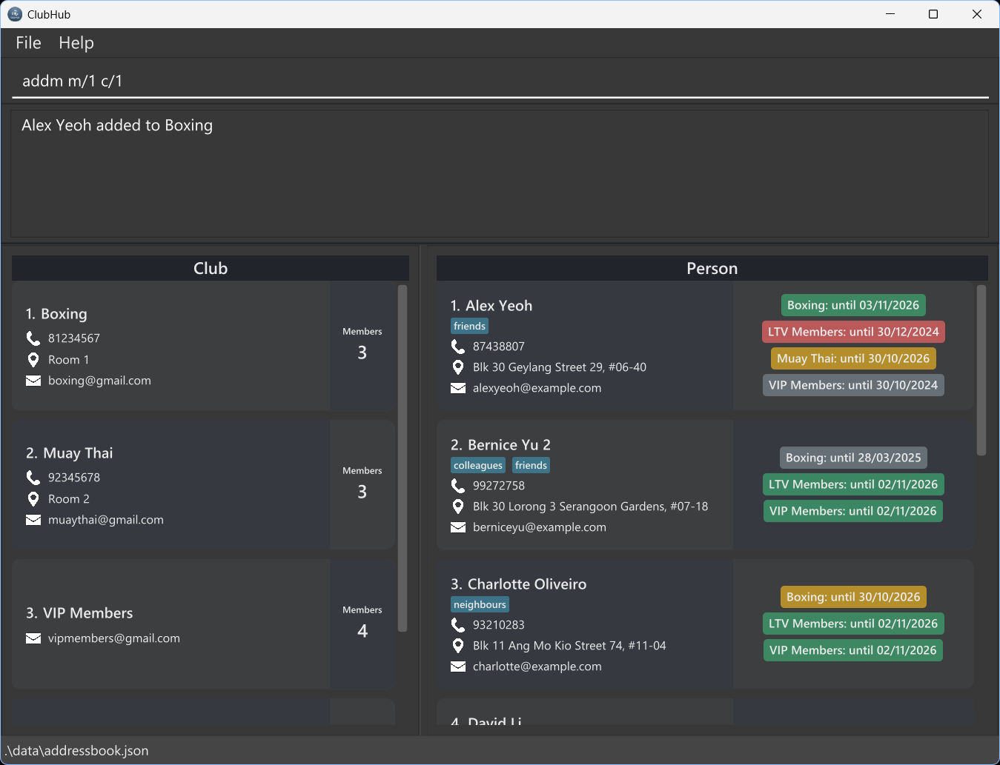

ClubHub allows you to manage your contacts on your desktop with keyboard commands. If you type fast, you can complete your contact management tasks faster with ClubHub than with mouse-based apps.

* Table of Contents
{:toc}

--------------------------------------------------------------------------------------------------------------------

## Quick start

1. Ensure you have Java `17` or above installed in your Computer. 
   **Mac users:** Ensure you have the precise JDK version prescribed [here](https://se-education.org/guides/tutorials/javaInstallationMac.html).

2. Download the latest `.jar` file from [here](https://github.com/AY2526S1-CS2103T-F15b-4/tp/releases).

3. Copy the file to the folder you want to use as the _home folder_ for your AddressBook.

4. Open a command terminal.

If you're using Windows:

    Press Windows key + R on your keyboard.
    
    A small box will pop up. Type cmd inside it.
    
    Press Enter. A black window will appear — that’s the command terminal. 

If you're using macOS:

    Click the magnifying glass 🔍 in the top-right corner (Spotlight Search).
    
    Type Terminal and press Enter.
    
    A window with text will open — that’s the command terminal.

If you're using Linux:

    Press Ctrl + Alt + T together.
    
    Or search for “Terminal” in your applications.
    
    A terminal window will open.

`cd` into the folder you put the jar file in, and use the `java -jar addressbook.jar` command to run the application. 
   A GUI similar to the below should appear in a few seconds. Note how the app contains some sample data. 
   

Type the command in the command box and press Enter to execute it. e.g. typing **`help`** and pressing Enter will open the help window. 
   Some example commands you can try:

   * `findp` : Lists all contacts.

   * `add_person n/John Doe p/98765432 e/johnd@example.com a/John street, block 123, #01-01` : Adds a contact named `John Doe` to the Address Book.

   * `delete_person 3` : Deletes the 3rd contact shown in the current list.

   * `clear` : Deletes all data.

   * `exit` : Exits the app.

5. Refer to the [Features](#features) below for details of each command.

--------------------------------------------------------------------------------------------------------------------

## Features

**:information_source: Notes about the command format:** 

* Words in `UPPER_CASE` are the parameters to be supplied by the user. 
  e.g. in `add_person n/NAME`, `NAME` is a parameter which can be used as `add_person n/John Doe`.

* Items in square brackets are optional. 
  e.g `n/NAME [t/TAG]` can be used as `n/John Doe t/friend` or as `n/John Doe`.

* Items with `…`​ after them can be used multiple times including zero times. 
  e.g. `[t/TAG]…​` can be used as ` ` (i.e. 0 times), `t/friend`, `t/friend t/family` etc.

* Parameters can be in any order. 
  e.g. if the command specifies `n/NAME p/PHONE_NUMBER`, `p/PHONE_NUMBER n/NAME` is also acceptable.

* Extraneous parameters for commands that do not take in parameters (such as `help`, `list`, `exit` and `clear`) will be ignored. 
  e.g. if the command specifies `help 123`, it will be interpreted as `help`.

* If you are using a PDF version of this document, be careful when copying and pasting commands that span multiple lines as space characters surrounding line-breaks may be omitted when copied over to the application.

### Viewing help : `help`

Shows a message explaining how to access the help page.

Format: `help`

### Adding a person: `add_person`

Adding a person to the address book helps you keep your contacts organized and easy to find.
By entering their details — like name, email, phone, and address — you can store everything in one place.
You only need to provide the essential information of name and email, and you can always edit or add more later.
This ensures you'll never have to dig through scattered notes or emails again to find someone’s contact.

Format: `add_person n/NAME e/EMAIL [p/PHONE_NUMBER] [a/ADDRESS] [t/TAG]…​`

:bulb: **Tip:**
A person can have any number of tags (including 0)

Examples:
* `add_person n/John Doe p/98765432 e/johnd@example.com a/John street, block 123, #01-01`
* `add_person n/Betsy Crowe e/betsycrowe@example.com a/Newgate Prison p/1234567`

### Adding a club: `add_club`

Adding a club to the address book lets you keep track of different clubs in one place. 
By entering details like the club’s name, email, phone and address, you can easily manage and reach out to them whenever needed. 
You can include as much or as little information as the club's name and email — and update it later if things change. 
This makes it simple to stay connected with all your clubs without juggling multiple sources.

Format: `add_club n/NAME e/EMAIL [p/PHONE_NUMBER] [a/ADDRESS] [t/TAG]…​`

:bulb: **Tip:**
A club can have any number of tags (including 0)

Examples:
* `add_club n/Bowling Club p/93456789 e/bowling@example.com a/15 Boon Lay Way`
* `add_club n/Cycling e/cycling@example.com a/45 Cycling Street p/1234567`

### Adding multiple persons to multiple clubs : `add_to`

Adds multiple persons to multiple clubs in the address book.

Format: `add_to m/INDEXES c/INDEXES [d/DURATION]`

* The `PERSON_INDEXES` and `CLUB_INDEXES` are space-separated lists of indexes.
* `DURATION` is the duration to extend the expiry date by in months. The duration must be an integer between 1 and 12 inclusive.
* The default duration is 12 months if not specified.
* Join date is set to today’s date.
* Expiry date is set to join date plus duration months.
* Adds the membership of the persons at the specified `PERSON_INDEXES` to the clubs at the specified `CLUB_INDEXES`.
* The indexes refer to the index numbers shown in the displayed person list & club list accordingly. The indexes **must be positive integers** 1, 2, 3, …​

Examples:
* `add_to m/1 3 c/2 4 d/6` Adds the membership of the 1st and 3rd persons in the 2nd and 4th clubs with expiry date 6 months from today.

### Removing multiple persons from multiple clubs : `remove_from`

Removes multiple persons from multiple clubs in the address book.

Format: `remove_from m/INDEXES c/INDEXES`

* The `PERSON_INDEXES` and `CLUB_INDEXES` are space-separated lists of indexes.
* Removes the membership of the persons at the specified `PERSON_INDEXES` from the clubs at the specified `CLUB_INDEXES`.
* The indexes refer to the index numbers shown in the displayed person list & club list accordingly. The indexes **must be positive integers** 1, 2, 3, …​

Examples:
* `remove_from m/1 3 c/2 4` Removes the membership of the 1st and 3rd persons in the 2nd and 4th clubs.

### Renew membership of a person in a club : `renew`

Renews the membership of a person in a club in the address book with renewal duration given.

Format: `renew m/PERSON_INDEX c/CLUB_INDEX d/DURATION`

* Renew the membership of the person at the specified `PERSON_INDEX` in the club at the specified `CLUB_INDEX`.
* `DURATION` is the duration to extend the expiry date by in months. The duration must be an integer between 1 and 12 inclusive.
* The index refers to the index number shown in the displayed person list & club list accordingly. The index **must be a positive integer** 1, 2, 3, …​
* If expiry date was in the past, setting new expiry date from today.
* If expiry date was in the future, extending from current expiry date.

Examples:
* `renew m/1 c/2 d/6` Renews the membership of the 1st person in the 2nd club by 6 months.

### Cancel membership of a person in a club : `cancel`

Cancels the membership of a person in a club in the address book.

Format: `cancel m/PERSON_INDEX c/CLUB_INDEX`

* Cancels the membership of the person at the specified `PERSON_INDEX` in the club at the specified `CLUB_INDEX`.
* The index refers to the index number shown in the displayed person list & club list accordingly.
* The index **must be a positive integer** 1, 2, 3, …​
* The membership remains valid until the expiry date. The membership cannot be renewed but can be reactivated.
* The membership will not be deleted.
* To remove the person from the club, use the `remove_from` command.

Examples:
* `cancel m/1 c/2` Cancels the membership of the 1st person in the 2nd club.
 
### Reactivating membership of a person in a club : `reactivate`

Reactivates the **cancelled** membership of a person in a club in the address book with renewal duration given.
Format: `reactivate m/PERSON_INDEX c/CLUB_INDEX d/DURATION`

* Reactivates the membership of the person at the specified `PERSON_INDEX` in the club at the specified `CLUB_INDEX`.
* `DURATION` is the duration to extend the expiry date by in months. The duration must be an integer between 1 and 12 inclusive.
* The index refers to the index number shown in the displayed person list & club list accordingly. The index **must be a positive integer** 1, 2, 3, …​
* If expiry date was in the past, setting new expiry date from today.
* If expiry date was in the future, extending from current expiry date.
 
Examples:
* `reactivate m/1 c/2 d/6` Reactivates the membership of the 1st person in the 2nd club by 6 months.

Format: `list`

### Editing a person : `edit_person`

Editing a person in your address book helps you keep their
details up to date without having to create a new entry.
You can quickly change their name, phone, email, address, or tags,
so your contact list always stays accurate and organised.

Format: `edit_person INDEX [n/NAME] [p/PHONE] [e/EMAIL] [a/ADDRESS] [t/TAG]…​`

* Edits the person at the specified `INDEX`. The index refers to the index number shown in the displayed person list. The index **must be a positive integer** 1, 2, 3, …​
* At least one of the optional fields must be provided.
* Existing values will be updated to the input values.
* When editing tags, the existing tags of the person will be removed i.e adding of tags is not cumulative.
* You can remove all the person’s tags by typing `t/` without
    specifying any tags after it.

Examples:
*  `edit_person 1 p/91234567 e/johndoe@example.com` Edits the phone number and email address of the 1st person to be `91234567` and `johndoe@example.com` respectively.
*  `edit_person 2 n/Betsy Crower t/` Edits the name of the 2nd person to be `Betsy Crower` and clears all existing tags.

### Editing a club : `edit_club`

Editing a club in your address book helps you keep its
details up to date without having to create a new entry.
You can quickly change its name, phone, email, address, or tags,
so your contact list always stays accurate and organised.

Format: `edit_club INDEX [n/NAME] [p/PHONE] [e/EMAIL] [a/ADDRESS] [t/TAG]…​`

* Edits the club at the specified `INDEX`. The index refers to the index number shown in the displayed club list. The index **must be a positive integer** 1, 2, 3, …​
* At least one of the optional fields must be provided.
* Existing values will be updated to the input values.
* When editing tags, the existing tags of the club will be removed i.e adding of tags is not cumulative.
* You can remove all the club’s tags by typing `t/` without
  specifying any tags after it.

Examples:
*  `edit_club 1 p/91234567 e/dance@example.com` Edits the phone number and email address of the 1st club to be `91234567` and `dance@example.com` respectively.
*  `edit_club 2 n/Bowling t/` Edits the name of the 2nd club to be `Bowling` and clears all existing tags.
 
### Locating persons: `findp`

Finds and displays persons that match all search conditions specified with the command. If no search condition is provided, findp displays the full list of persons.

Format: `findp [SEARCH_CONDITION_1 SEARCH_KEYWORDS_1] [SEARCH_CONDITION_2 SEARCH_KEYWORDS_2] ... [SEARCH_CONDITION_N SEARCH_KEYWORDS_N]`
Search conditions: 
`n/ [NAMES]` - match persons containing any of the names (separated by whitespace) specified in NAMES 
`t/ [TAGS]` - match persons tagged with tags containing any of the names (separated by whitespace) specified in TAGS

* The search is case-insensitive. e.g. `hans` will match `Hans`
* The order of the search conditions and keywords does not matter. 
  e.g. `n/ Hans Bo` will match `n/ Bo Hans` and `n/ Hans t/ friend` will match `t/ friend n/ Hans`
* Only full words will be matched e.g. `Han` will not match `Hans`
* All search conditions must be met for the target (i.e. `AND` search).
  e.g. `n/ Hans t/ friend` will only return persons with both `Hans` in their name and are tagged with `friend`
* Within each search condition, targets need only match one of the specified keywords (i.e. `OR` search).
  e.g. `n/ Hans Bo` may return `Hans Gruber`, `Bo Yang`
* Search conditions of the same type may be repeated. Each will be treated as a separate condition.
  e.g. To search for `Hans Bo` without returning `Hans Gruber` or `Bo Yang`, use `n/ Hans n/ Bo`

Examples:
* `findp` returns all persons 
* `findp n/ Alex` returns `alex` and `Alex yeoh`
* `findp n/ alex david` returns `alex` and `Alex yeoh` and `David Li`
* `findp n/ alex n/ Yeoh` returns `Alex yeoh`
* `findp t/ friend` returns all persons tagged with `friend`
* `findp n/ Alex t/ friend` returns only `Alex yeoh` because `Alex yeoh` is tagged with `friend` but `alex` is not  
  

### Locating clubs: `findc`

Finds and displays clubs that match all search conditions specified with the command. If no search condition is provided, findp displays the full list of clubs.

Format: `findc [SEARCH_CONDITION_1 SEARCH_KEYWORDS_1] [SEARCH_CONDITION_2 SEARCH_KEYWORDS_2] ... [SEARCH_CONDITION_N SEARCH_KEYWORDS_N]`
Search conditions:
`n/ [NAMES]` - match clubs containing any of the names (separated by whitespace) specified in NAMES
`t/ [TAGS]` - match clubs tagged with tags containing any of the names (separated by whitespace) specified in TAGS

* The search is case-insensitive. e.g. `archery` will match `Archery`
* The order of the search conditions and keywords does not matter.
  e.g. `n/ Archery NUS` will match `n/ NUS Archery` and `n/ Archery t/ evening` will match `t/ evening n/ Archery`
* Only full words will be matched e.g. `ArcheryNUS` will not match `Archery`
* All search conditions must be met for the target (i.e. `AND` search).
  e.g. `n/ Ball t/ evening` will only return clubs with both `Ball` in their name and are tagged with `evening`
* Within each search condition, targets need only match one of the specified keywords (i.e. `OR` search).
  e.g. `n/ Eight Ball` may return `Basket Ball`, `eight pm dance`
* Search conditions of the same type may be repeated. Each will be treated as a separate condition.
  e.g. To search for `Eight Ball` without returning `Basket Ball` or `eight pm dance`, use `n/ Eight n/ Ball`

Examples:
* `findc` returns all clubs
* `findc n/ Study` returns `study` and `NUS Study`
* `findc n/ NUS study` returns `study` and `NUS Study` and `NUS Guitar`
* `findc n/ NUS n/ study` returns `NUS Study`
* `findc t/ NTU` returns all clubs tagged with `NTU`
* `findc n/ Study t/ NTU` returns only `study` because `study` is tagged with `NTU` but `NUS Study` is not  
  

### Listing a person and their associated clubs : `list_memberships`

Finds and displays clubs which the specified person is a member of.

Format: `list_memberships INDEX`

* The target person is specified by its `INDEX` shown in the displayed person list.
* The index **must be a positive integer** 1, 2, 3, …​
* In the club list, all clubs associated with the target are displayed
* In the person list, only the target is displayed

Examples:
* `findp` followed by `list_memberships 2` lists the 2nd person in the address book and all clubs which they are a member of.
* `findp n/ Betsy` followed by `list_memberships 1` lists the 1st person in the results of the `find` command and their associated clubs.

### Listing a club and their members : `list_members`

Finds and displays persons which are members of the specified club.

Format: `list_members INDEX`

* The target club is specified by its `INDEX` shown in the displayed club list.
* The index **must be a positive integer** 1, 2, 3, …​
* In the person list, all persons associated with the target are displayed
* In the club list, only the target is displayed

Examples:
* `findc` followed by `list_members 2` lists the 2nd club in the address book and all its members.
* `findc n/ Tennis` followed by `list_members 1` lists the 1st club in the results of the `find` command and its members.

### Deleting a person : `delete_person`

Deletes the specified person from the address book.

Format: `delete_person INDEX`

* Deletes the person at the specified `INDEX`.
* The index refers to the index number shown in the displayed person list.
* The index **must be a positive integer** 1, 2, 3, …​

Examples:
* `findp` followed by `delete_person 2` deletes the 2nd person in the address book.
* `findp n/ Betsy` followed by `delete_person 1` deletes the 1st person in the results of the `find` command.

### Deleting a club : `delete_club`

Format: `delete_club INDEX`

* Deletes the club at the specified `INDEX`.
* The index refers to the index number shown in the displayed club list.
* The index **must be a positive integer** 1, 2, 3, …​

Examples:
* `findc` followed by `delete 2` deletes the 2nd club in the address book.
* `findc n/ Tennis` followed by `delete 1` deletes the 1st club in the results of the `find` command.

### Copying a person's details : `get_person`

Copies the details of a person to the user's clipboard. By default, copies all details apart from memberships. Conditions may be supplied to specify which details to copy.

Format: `get_person INDEX [/OPTIONAL_CONDITIONS]`
Optional conditions:
* `n` specifies the person's name to be included in the copy.
* `p` specifies the person's phone number to be included in the copy.
* `e` specifies the person's email to be included in the copy.
* `a` specifies the person's address to be included in the copy.
* `m` specifies the inclusion of the names of all clubs of which the person is a member of.

* Copies the details of the person at the specified `INDEX`.
* The index refers to the index number shown in the displayed person list.
* The index **must be a positive integer** 1, 2, 3, …​
* `/` must be used between the index and optional conditions, if any are provided
* Multiple optional conditions may be added by appending each keyword. Non-matching keywords are ignored.
  e.g. `get_person 1 /abcde` will copy the 1st person's address and email to the clipboard. 

Examples:
* `findp n/ John` followed by `get_person 1 /pe` copies the phone number and email address of the 1st person in the results of the `find` command.
* `findp` followed by `get_person 2` copies all details (excluding memberships) of the 2nd person in the address book.
  

### Copying a club's details : `get_club`

Copies the details of a club to the user's clipboard. By default, copies all details apart from members. Conditions may be supplied to specify which details to copy, including an option to copy all members' details.

Format: `get_club INDEX [/OPTIONAL_CONDITIONS]`
Optional conditions:
* `n` specifies the club's name to be included in the copy.
* `p` specifies the club's phone number to be included in the copy.
* `e` specifies the club's email to be included in the copy.
* `a` specifies the club's address to be included in the copy.
* `m` specifies the inclusion of the names of all clubs members.
* `*` specifies the full details of a club, plus the full details of all its members, to be copied.

* Copies the details of the club at the specified `INDEX`.
* The index refers to the index number shown in the displayed club list.
* The index **must be a positive integer** 1, 2, 3, …​
* `/` must be used between the index and optional conditions, if any are provided
* Multiple optional conditions may be added by appending each keyword. Non-matching keywords are ignored.
  e.g. `get_person 1 /abcde` will copy the 1st club's address and email to the clipboard.

Examples:
* `findc n/ Band` followed by `get_club 1 /pe` copies the phone number and email address of the 1st club in the results of the `find` command.
* `findc` followed by `get_club 2` copies all details (excluding members) of the 2nd club in the address book.
* `findc` followed by `get_club 2 /*` copied all details (including member details) of the 2nd club in the address book.
  

### Clearing all entries : `clear`

Clears all entries from the address book.

Format: `clear`

### Exiting the program : `exit`

Exits the program.

Format: `exit`

### Saving the data

AddressBook data are saved in the hard disk automatically after any command that changes the data. There is no need to save manually.

### Editing the data file

AddressBook data are saved automatically as a JSON file `[JAR file location]/data/addressbook.json`. Advanced users are welcome to update data directly by editing that data file.

:exclamation: **Caution:**
If your changes to the data file makes its format invalid, AddressBook will discard all data and start with an empty data file at the next run. Hence, it is recommended to take a backup of the file before editing it. 
Furthermore, certain edits can cause the AddressBook to behave in unexpected ways (e.g., if a value entered is outside of the acceptable range). Therefore, edit the data file only if you are confident that you can update it correctly.

### Archiving data files `[coming in v2.0]`

_Details coming soon ..._

--------------------------------------------------------------------------------------------------------------------

## FAQ

**Q**: How do I transfer my data to another Computer? 
**A**: Install the app in the other computer and overwrite the empty data file it creates with the file that contains the data of your previous AddressBook home folder.

--------------------------------------------------------------------------------------------------------------------

## Known issues

1. **When using multiple screens**, if you move the application to a secondary screen, and later switch to using only the primary screen, the GUI will open off-screen. The remedy is to delete the `preferences.json` file created by the application before running the application again.
2. **If you minimize the Help Window** and then run the `help` command (or use the `Help` menu, or the keyboard shortcut `F1`) again, the original Help Window will remain minimized, and no new Help Window will appear. The remedy is to manually restore the minimized Help Window.

--------------------------------------------------------------------------------------------------------------------

## Command summary

Action | Format, Examples
--------|------------------
**Add Person** | `add_person n/NAME p/PHONE_NUMBER e/EMAIL a/ADDRESS [t/TAG]…​`   e.g., `add_person n/James Ho p/22224444 e/jamesho@example.com a/123, Clementi Rd, 1234665`
**Add Club** | `add_club n/NAME p/PHONE_NUMBER e/EMAIL a/ADDRESS [t/TAG]…​`   e.g., `add_club n/Basketball Club p/22232434 e/basketball@example.com a/123, Bukit Batok Rd, 1234865`
**Add to Clubs** | `add_to m/PERSON_INDEXES c/CLUB_INDEXES [d/DURATION]`   e.g., `add_to m/1 2 c/3 4 d/6`
**Remove from Clubs** | `remove_from m/PERSON_INDEXES c/CLUB_INDEXES`   e.g., `remove_from m/1 2 c/3 4`
**Renew Membership** | `renew m/PERSON_INDEX c/CLUB_INDEX d/DURATION`   e.g., `renew m/1 c/2 d/6`
**Cancel Membership** | `cancel m/PERSON_INDEX c/CLUB_INDEX`   e.g., `cancel m/1 c/2`
**Reactivate Membership** | `reactivate m/PERSON_INDEX c/CLUB_INDEX d/DURATION`   e.g., `reactivate m/1 c/2 d/6`
**Clear** | `clear`
**Delete Person** | `delete_person INDEX`  e.g., `delete_person 3`
**Delete Club** | `delete_club INDEX`  e.g., `delete_club 3`
**Edit Person** | `edit_person INDEX [n/NAME] [p/PHONE_NUMBER] [e/EMAIL] [a/ADDRESS] [t/TAG]…​`  e.g.,`edit_person 2 n/James Lee e/jameslee@example.com`
**Edit Club** | `edit_club INDEX [n/NAME] [p/PHONE_NUMBER] [e/EMAIL] [a/ADDRESS] [t/TAG]…​`  e.g.,`edit_club 2 n/Tennis e/tennis@example.com`
**Find Person** | `findp [SEARCH_CONDITION_1 SEARCH_KEYWORDS_1] [SEARCH_CONDITION_2 SEARCH_KEYWORDS_2] ... [SEARCH_CONDITION_N SEARCH_KEYWORDS_N]`  e.g., `findp n/ James Jake t/ friend`
**Find Club** | `findc [SEARCH_CONDITION_1 SEARCH_KEYWORDS_1] [SEARCH_CONDITION_2 SEARCH_KEYWORDS_2] ... [SEARCH_CONDITION_N SEARCH_KEYWORDS_N]`  e.g., `findp n/ Dance Guitar t/ monday`
**List Memberships** | `list_memberships INDEX`  e.g., `list_memberships 1`
**List Members** | `list_members INDEX`  e.g., `list_members 1`
**Get Person** | `get_person INDEX [/OPTIONAL_CONDITIONS]`  e.g., `get_person 2 /pae`
**Get Club** | `get_club INDEX [/OPTIONAL_CONDITIONS]`  e.g., `get_club 2 /*`
**Help** | `help`
**Exit** | `exit`
