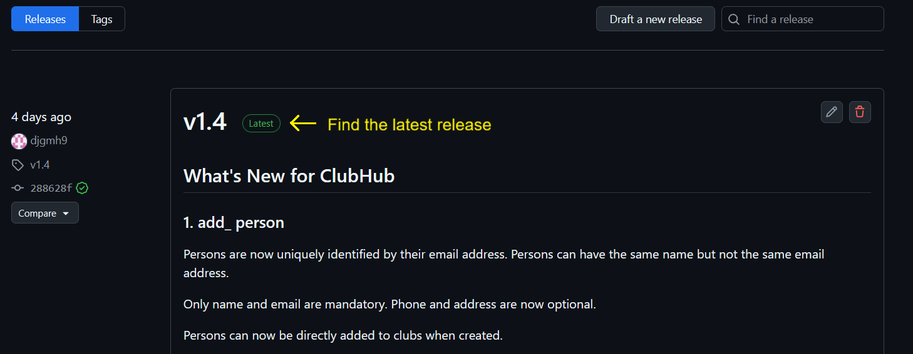
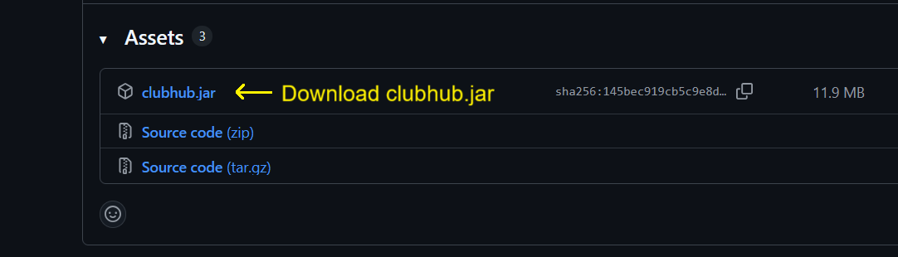
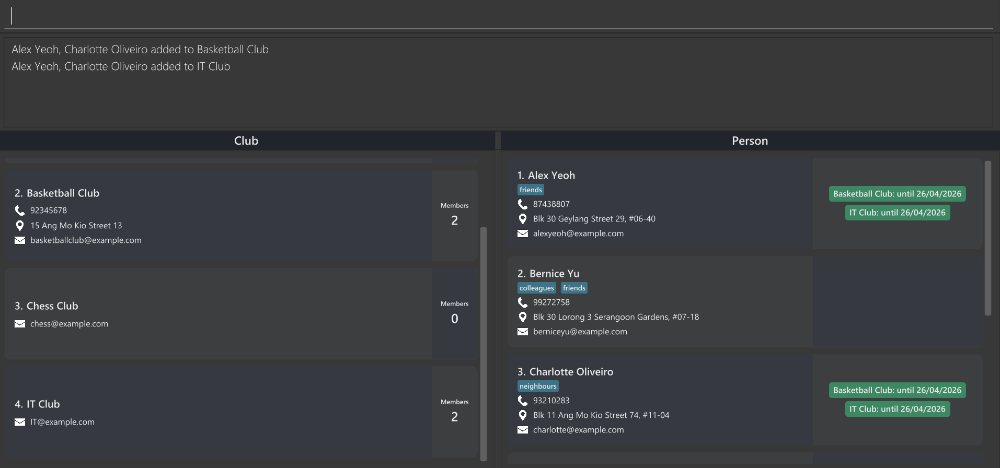

ClubHub is a fast, keyboard-driven **contact & membership management app** designed for people *who run multiple groups or clubs* — from gym managers and volunteer coordinators to hobby group organizers. 

Tired of juggling messy spreadsheets or address books? Want to keep track of who hasn't paid yet? ClubHub lets you create, view, search, and organize contacts and memberships across different groups - all without taking your hands off your keyboard.

With its intuitive, keyboard-first workflow, Clubhub lets you manage memberships, roles, and clubs with unmatched speed and effeciency. Stay organised and focus on what matters most - your members and your community.

* Table of Contents
{:toc}

--------------------------------------------------------------------------------------------------------------------

## Quick start

1. You can get Java 17 here  if you don't have it yet. 
[Java 17 for Windows](https://se-education.org/guides/tutorials/javaInstallationWindows.html) 
[Java 17 for Linux](https://se-education.org/guides/tutorials/javaInstallationLinux.html) 

   **Mac users:** Ensure you have the precise JDK version prescribed [here](https://se-education.org/guides/tutorials/javaInstallationMac.html).

2. Download the latest ClubHub app`.jar` file from [here](https://github.com/AY2526S1-CS2103T-F15b-4/tp/releases).
  
   
   

3. Copy the file to the folder you want to use as the _home folder_ for ClubHub.

4. Open a command terminal.

If you're using Windows:

    Press Windows key + R on your keyboard.
    
    A small box will pop up. Type cmd inside it.
    
    Press Enter. A black window will appear — that’s the command terminal. 

If you're using macOS:

    Click the magnifying glass 🔍 in the top-right corner (Spotlight Search).
    
    Type Terminal and press Enter.
    
    A window with text will open — that’s the command terminal.

If you're using Linux:

    Press Ctrl + Alt + T together.
    
    Or search for “Terminal” in your applications.
    
    A terminal window will open.

`cd` into the folder you put the jar file in, and use the `java -jar clubhub.jar` command to run the application. 
   A GUI similar to the below should appear in a few seconds. Note how the app contains some sample data. 
   

Type the command in the command box and press Enter to execute it. e.g. typing **`help`** and pressing Enter will open the help window. 
   Some example commands you can try:

   * `list` : Lists all contacts and clubs.

   * `add_person n/John Doe p/98765432 e/johnd@example.com a/John street, block 123, #01-01` : Adds a contact named `John Doe` to ClubHub.

   * `delete_person 3` : Deletes the 3rd contact shown in the current list.

   * `clear` : Deletes all data.

   * `exit` : Exits the app.

5. Refer to the [Command Formats](#command formats) below for details of each command.

--------------------------------------------------------------------------------------------------------------------

## Command Formats

**:information_source: Notes about the command format:** 

* Command keywords are case-insensitive. 
  e.g. both `delete_person 2` and `DELETE_Person 2` are acceptable.

* Some commands have both a short keyword version and a long keyword version. 
  e.g. `delete_person 2` and `deletep 2` are the same command.

* Words in `UPPER_CASE` are the parameters to be supplied by the user. 
  e.g. in `add_person n/NAME`, `NAME` is a parameter which can be used as `add_person n/John Doe`.

* Items in square brackets are optional. 
  e.g `n/NAME [t/TAG]` can be used as `n/John Doe t/friend` or as `n/John Doe`.

* Items with `…`​ after them can be used multiple times including zero times. 
  e.g. `[t/TAG]…​` can be used as ` ` (i.e. 0 times), `t/friend`, `t/friend t/family` etc.

* Parameters can be in any order. 
  e.g. if the command specifies `n/NAME p/PHONE_NUMBER`, `p/PHONE_NUMBER n/NAME` is also acceptable.

* Extraneous parameters for commands that do not take in parameters (such as `help`, `list`, `exit`) will be ignored. 
  e.g. if the command specifies `help 123`, it will be interpreted as `help`.

* If you are using a PDF version of this document, be careful when copying and pasting commands that span multiple lines as space characters surrounding line-breaks may be omitted when copied over to the application.

--------------------------------------------------------------------------------------------------------------------

## Viewing help : `help`

Shows a link to the user guide page.

**Format: `help`**

--------------------------------------------------------------------------------------------------------------------

## Adding

### Adding a person: `add_person` (or `addp`)

Adding a person to ClubHub helps you keep your contacts organized and easy to find.
You only need to provide the essential information of name and email, and you can always edit or add more later.

**Format: `add_person n/NAME e/EMAIL [p/PHONE_NUMBER] [a/ADDRESS] [t/TAG] [c/CLUB_INDEXES]​`**

ℹ️ **Info on Mandatory Fields:**  
Name and email are both mandatory. 

ℹ️ **Info on Unique Fields:**  
Email is unique to a person.

⚠️ **Warning on Phone Number Inputs:**  
Phone numbers are allowed to have letters and some special characters.

⚠️ **Warning on Duplicates:**  
Persons can have the same name. Persons can share the same address or phone number.

**Command examples:**
* `add_person n/John Doe p/98765432 e/johnd@example.com a/John street, block 123, #01-01`
* `addp n/Betsy Crowe e/betsycrowe@example.com a/Newgate Prison c/1 3`

### Adding a club: `add_club` (or `addc`)

Adding a club to ClubHub lets you keep track of different clubs in one place.
You only need to provide the essential information of name and email, and you can always edit or add more later.

**Format: `add_club n/NAME e/EMAIL [p/PHONE_NUMBER] [a/ADDRESS] [t/TAG]​`**

ℹ️ **Info on Mandatory Fields:**  
Name and email are both mandatory. 

ℹ️ **Info on Unique Fields:**  
Club name is unique to a club. Email is also unique to a club.

⚠️ **Warning on Phone Number Inputs:**  
Phone numbers are allowed to have letters and some special characters.

⚠️ **Warning on Duplicates:**      
Clubs can share the same address or phone number.
Club names that differ only by white spaces are allowed.

Example: "ClubHub" is considered a different club from "Club Hub".

**Command examples:**
* `add_club n/Bowling Club p/93456789 e/bowling@example.com a/15 Boon Lay Way`
* `addc n/Cycling e/cycling@example.com`

--------------------------------------------------------------------------------------------------------------------

## Memberships

    * There are 4 membership status: **Active, Expired, Pending Cancellation, and Cancelled**. 
    * A person with an expired membership is still considered as a member. The club owner can contact the person to reactivate or cancel his membership. 
    * Only a person with a Cancelled membership is considered no longer a member. 
    
    

### Adding memberships of multiple persons to multiple clubs : `add_membership`  (or `addm`)

Adds multiple persons' memberships to multiple clubs.

:bulb: **Tip:**
You can add a new person directly to existing clubs with add_person c/INDEXES!

**Format: `add_membership m/PERSON_INDEXES c/CLUB_INDEXES [d/DURATION]`**

> * `PERSON_INDEXES` and `CLUB_INDEXES` are space-separated lists of indexes.
> * `DURATION` is the duration to extend the expiry date by in months. The duration must be an integer between 1 and 12 inclusive.
> * The default duration is 12 months if not specified.
> * Join date is set to today’s date.
> * Expiry date is set to join date plus duration.

**Command examples:**
* `add_membership m/1 3 c/2 4 d/6` Adds the membership of the 1st and 3rd persons in the 2nd and 4th clubs with expiry date 6 months from today.
  

### Delete memberships of multiple persons from multiple clubs : `delete_membership`  (or `deletem`)

Deletes multiple persons' memberships from multiple clubs in the club manager.

⚠️ **Warning:**      
    `deletem` will delete the person's membership history as well. To keep the membership history, use `cancel` instead.

**Format: `delete_membership m/PERSON_INDEXES c/CLUB_INDEXES`**

> * `PERSON_INDEXES` and `CLUB_INDEXES` are space-separated lists of indexes.

**Command examples:**
* `delete_membership m/1 3 c/2 4` Removes the membership of the 1st and 3rd persons in the 2nd and 4th clubs.

### Renew membership of a person in a club : `renew`

Renews the active membership of a person in a club with renewal duration given.

**Format: `renew m/PERSON_INDEX c/CLUB_INDEX d/DURATION`**

> * Only active memberships can be renewed.
> * `DURATION` is the duration to extend the expiry date by in months. The duration must be an integer between 1 and 12 inclusive.
 
**Command examples:**
* `renew m/1 c/2 d/6` Renews the membership of the 1st person in the 2nd club by 6 months.

### Cancel membership of a person in a club : `cancel`

Cancels the membership of a person in a club.

**Format: `cancel m/PERSON_INDEX c/CLUB_INDEX`**

> * The membership **remains valid until the expiry date**. This is called **Pending Cancellation** status. The membership cannot be renewed but can be reactivated.
> * The membership status will change from **Pending Cancellation** to **Cancelled** when the expiry date has passed.

ℹ️ **Info:**  
The membership will not be deleted. To remove the person and his membership history from the club, use `delete_membership`.

**Command examples:**
* `cancel m/1 c/2` Cancels the membership of the 1st person in the 2nd club.

### Reactivating membership of a person in a club : `reactivate`

Reactivates expired, pending cancellation, or cancelled membership of a person in a club with duration given.

ℹ️ **Info:**  
    Membership still active? See `renew` to extend an active membership.

**Format: `reactivate m/PERSON_INDEX c/CLUB_INDEX d/DURATION`**

> * `DURATION` is the duration to extend the expiry date by in months. The duration must be an integer between 1 and 12 inclusive.
> * If expiry date was in the past, setting new expiry date from today.
> * If expiry date was in the future, extending from current expiry date.
 
**Command examples:**
* `reactivate m/1 c/2 d/6` Reactivates the membership of the 1st person in the 2nd club by 6 months.

--------------------------------------------------------------------------------------------------------------------

## Listing and Finding

### Listing all clubs and contacts: `list` 

Simply lists every club and person you have saved in ClubHub.

### Finding persons: `find_person` (or `findp`)

Finds and displays persons (in the right list) that match all search conditions specified within the command.
If no condition is provided, `find_person` displays all persons. Possible search conditions include:
* `n/` - by name
* `a/` - by address
* `e/` - by email
* `p/` - by phone
* `t/` - by tag
* `s/` - by membership status

Each search condition is to be supplied with one or more search keywords.

**Format: `find_person [SEARCH_CONDITION SEARCH_KEYWORDS]...`**

 **Basic Usage: Finding by single field**

The find_person command can be used to locate persons using their basic fields, such as their name, address, email,
phone and tags. To do so, use the matching search condition (as displayed in the previous section) followed
by the keyword you wish to match for that condition (e.g. `findc n/ John`). **Do note that there should be
a space before each search condition or keyword.**

ℹ️ Info:  
Can't remember the exact value of the field? Not to worry, find matches keywords by substrings and is case-insensitive,
meaning that calling "findp n/ john" will return persons with names like "John" and "johnathan lee".

 **Advanced Usage: Supplying multiple keywords**

Each search condition may be supplied with multiple keywords, **any of** which may be used to match the target. For
example, `findp n/ Lee Li` would return persons with names like "Jane Li" and "Lee Richard".

 **Advanced Usage: Supplying multiple conditions**

Each command may also be supplied with multiple search conditions. However, unlike the case with keywords,
**all conditions** must match the target. For example, `findp t/ friend n/ John n/ Lee` will only return persons
tagged with "friend" whose names contain both "John" and "Lee".

 **Advanced Usage: Finding by membership status**

The find_club command can be used to locate persons with memberships of a particular status, such as persons with
expired memberships. To do so, use the `s/` condition, **but only with the following keywords:**
* `a` - for active memberships
* `e` - for expired memberships
* `p` - for memberships pending cancellation
* `c` - for canceled memberships

⚠️ Warning: 
Unlike other search conditions, "s/" matches all identifiable keywords within a single string of letters.
This means that "findp s/ active" will return all active, expired and canceled members, since the keywords
"a", "c", and "e" are all present.

 **Command examples:**
* `findp` displays all persons
* `findp n/ Alex` displays `alex` and `Alex yeoh`
* `findp n/ alex david` displays `alex` and `Alex yeoh` and `David Li`
* `findp n/ alex n/ Yeoh` displays `Alex yeoh`
* `findp n/ Alex t/ friend` displays only `Alex yeoh` because `Alex yeoh` is tagged with `friend` but `alex` is not  
  
  
 

### Finding clubs: `find_club` (or `findc`)

Finds and displays clubs (in the left list) that match all search conditions specified within the command.
If no condition is provided, `find_club` displays all clubs. Possible search conditions include:
* `n/` - by name
* `a/` - by address
* `e/` - by email
* `p/` - by phone
* `t/` - by tag
* `s/` - by membership status

Each search condition is to be supplied with one or more search keywords.

**Format: `find_club [SEARCH_CONDITION SEARCH_KEYWORDS]...`**

 

ℹ️ Info:  
The find_club command is identical to the find_person command in its usage, the only difference being that it
searches for clubs rather than persons. Hence, you may refer to the find_person command above for detailed guidance 
on its usage.

 **Command examples**

Here are some sample commands:
* `findc` displays all clubs
* `findc n/ Study` displays `study` and `Monday Study`
* `findc n/ Monday study` displays `study` and `Monday Study` and `Monday Guitar`
* `findc n/ Monday n/ study` displays `Monday Study`
* `findc n/ Study t/ 8pm` displays only `study` because `study` is tagged with `8pm` but `Monday Study` is not  
  
  
 

### Displaying a person and their associated clubs : `membership_person` (or `mp`)

Finds and displays a person and the clubs which they are a member of. By default, displays all clubs where the person has a non-canceled membership. Any number of optional conditions may be provided to specify (by status) which memberships and their associated clubs are to be displayed. Conditions include:
* `a` - for active memberships
* `e` - for expired memberships
* `p` - for memberships pending cancellation
* `c` - for canceled memberships

**Format: `membership_person INDEX [OPTIONAL_CONDITIONS]` **
Index refers to the current index of the person in the right list.

 **Command examples:**

Suppose Jane is the second person in the current list. Jane has an active membership with ClubA, an expired one with 
ClubE, one pending cancellation with ClubP, and a canceled one with ClubC.
* `membership_person 2` displays Jane along with ClubA, ClubE and ClubP
* `membership_person 2 p c` displays Jane along with ClubP and ClubC.

 

### Displaying a club and their associated persons : `membership_club` (or `mc`)

Finds and displays a club and persons which are members of it. By default, displays all members with a non-canceled membership. Any number of optional conditions may be provided to specify (by status) which memberships and their associated persons are to be displayed. Conditions include:
* `a` - for active memberships
* `e` - for expired memberships
* `p` - for memberships pending cancellation
* `c` - for canceled memberships

**Format: `membership_club INDEX [OPTIONAL_CONDITIONS]` **
Index refers to the current index of the club in the left list.

 **Command examples:**

Suppose Archery is the second club in the current list. Archery has an active member PersonA, an expired member PersonE, one pending cancellation PersonP, and a canceled member PersonC.
* `membership_club 2` displays Archery along with PersonA, PersonE and PersonP
* `membership_club 2 p c` displays Archery along with PersonP and PersonC.

 

--------------------------------------------------------------------------------------------------------------------

## Editing

### Editing a person : `edit_person`  (or `editp`)

Editing a person in ClubHub helps you keep their
details up to date without having to create a new entry.

**Format: `edit_person INDEX [n/NAME] [p/PHONE] [e/EMAIL] [a/ADDRESS] [t/TAG]…​`**
* Edits the person at the specified `INDEX`. The index refers to the index number shown in the displayed person list. The index **must be a positive integer** 1, 2, 3, …​
* At least one of the optional fields must be provided.
* Existing values will be updated to the input values.
* When editing tags, the existing tags of the person will be removed i.e adding of tags is not cumulative.
* You can remove all the person’s tags by typing `t/` without
  specifying any tags after it.
  

ℹ️ **Info:**  
All fields can be edited to a different case. However, name and email remain mandatory. 

⚠️ **Warning on Phone Number Inputs:**  
Phone numbers are allowed to have letters and some special characters.

⚠️ **Warning on Duplicates:**  
Persons can have the same name. Persons can share the same address or phone number.

Command examples:
*  `edit_person 1 p/91234567 e/johndoe@example.com` Edits the phone number and email address of the 1st person to be `91234567` and `johndoe@example.com` respectively.
*  `editp 2 n/Betsy Crower t/` Edits the name of the 2nd person to be `Betsy Crower` and clears all existing tags.

### Editing a club : `edit_club`  (or `editc`)

Editing a club in ClubHub helps you keep club details up to date without having to create a new entry.

**Format: `edit_club INDEX [n/NAME] [p/PHONE] [e/EMAIL] [a/ADDRESS] [t/TAG]…​`**

* Edits the club at the specified `INDEX`. The index refers to the index number shown in the displayed club list. The index **must be a positive integer** 1, 2, 3, …​
* At least one of the optional fields must be provided.
* Existing values will be updated to the input values.
* When editing tags, the existing tags of the club will be removed i.e adding of tags is not cumulative.
* You can remove all the club’s tags by typing `t/` without specifying any tags after it.

ℹ️ **Info:**  
All fields can be edited to a different case. However, name and email remain mandatory.  

⚠️ **Warning on Phone Number Inputs:**  
Phone numbers are allowed to have letters and some special characters.

⚠️ **Warning on Duplicates:**  
Clubs can share the same address or phone number. Club names that differ only by white spaces are allowed.

Example: "ClubHub" is considered a different club from "Club Hub".

Command examples:
*  `edit_club 1 p/91234567 e/dance@example.com` Edits the phone number and email address of the 1st club to be `91234567` and `dance@example.com` respectively.
*  `editc 2 n/Bowling t/` Edits the name of the 2nd club to be `Bowling` and clears all existing tags.

--------------------------------------------------------------------------------------------------------------------

## Getting (Copying to clipboard)

### Getting a person's details : `get_person` (or `getp`)

Copies the details of a person to the clipboard. By default, copies the name, phone, email, address and tags. Any number of optional conditions may be supplied to specify which details to include in the copy. Possible conditions are:
* `n` - include name
* `p` - include phone
* `e` - include email
* `a` - include address
* `m` - include names of all clubs which this person is a member of

**Format: `get_person INDEX [OPTIONAL_CONDITIONS]`**

Index refers to the index in the person list.

 

**Command examples:**
* `get_person 1 p e` copies the phone and email of the 1st person in the right list.
* `get_person 2` copies the name, phone, email, address and tags of the 2nd person in the right list. 
  
  
 

### Copying a club's details : `get_club` (or `getc`)

Copies the details of a club to the clipboard. By default, copies the name, phone, email, address and tags. Any number of optional conditions may be supplied to specify which details to include in the copy. Possible conditions are:
* `n` - include name
* `p` - include phone
* `e` - include email
* `a` - include address
* `m` - include names of all persons which are members of this club
* `*` - include the name, phone, email, address and tags of the club **and all its members**

**Format: `get_club INDEX [OPTIONAL_CONDITIONS]` **

Index refers to the index in the club list.

 

**Command examples:**
* `get_club 1 p e` copies the phone and email of the 1st club in the left list.
* `get_club 2` copies the name, phone, email, address and tags of the 2nd club in the left list.
* `get_club 2 *` copies the name, phone, email, address and tags of the 2nd club (in the left list) and its members. 
  
  
 

### Getting a person's membership history: `get_history` (or `geth`)
Copies the membership history of a person to the clipboard.

**Format: `get_history INDEX`**

Index refers to the index in the person list.

 

**Command examples:**
* `get_history 2` copies the membership history of the 2nd person in the right list.

--------------------------------------------------------------------------------------------------------------------

## Deleting

### Deleting a person : `delete_person` (or `deletep`)

Deletes the specified person from ClubHub.

**Format: `delete_person INDEX`**

* Deletes the person at the specified `INDEX`.
* The index refers to the index number shown in the displayed person list.
* The index **must be a positive integer** 1, 2, 3, …​

**Command examples:**
* `find_person` followed by `delete_person 2` deletes the 2nd person in the contact list.
* `find_person n/ Betsy` followed by `delete_person 1` deletes the 1st person in the results of the `find_person` command.

### Deleting a club : `delete_club` (or `deletec`)

**Format: `delete_club INDEX`**

* Deletes the club at the specified `INDEX`.
* The index refers to the index number shown in the displayed club list.
* The index **must be a positive integer** 1, 2, 3, …​

**Command examples:**
* `find_club` followed by `delete_club 2` deletes the 2nd club in the club list.
* `find_club n/ Tennis` followed by `delete_club 1` deletes the 1st club in the results of the `find_club` command.

--------------------------------------------------------------------------------------------------------------------

## Sorting 

### Sorting persons : `sort_person` (or `sortp`)

Sorts the person list by the provided field(s) in ascending order.

**Format: `sort_person [n/] [p/] [e/] [a/]`**

* `n/` sorts the person list by name, `p/` by phone number, `e/` by email, and `a/` by address.
* 1 or more fields can be included. The app will sort the list based on the first field provided, with the subsequent field(s) used as a tiebreaker.

**Command examples:**
* `sort_person n/` sorts the person list by their names in ascending alphabetical order.
* `sortp a/ n/` sorts the person list by their address in ascending alphabetical order, followed by their names if there are persons with the same address.

### Sorting clubs : `sort_club` (or `sortc`)

Sorts the club list in ascending order of the provided fields.

**Format: `sort_club [n/] [p/] [e/] [a/]`**

* `n/` sorts the club list by name, `p/` by phone number, `e/` by email, and `a/` by address.
* 1 or more fields can be included. The app will sort the list based on the first field provided, with the subsequent field(s) used as a tiebreaker.

**Command examples:**
* `sort_club n/` sorts the club list by their names in ascending alphabetical order.
* `sortc a/ n/` sorts the club list by their address in ascending alphabetical order, followed by their names if there are clubs with the same address.

--------------------------------------------------------------------------------------------------------------------

## Others

### Clearing all entries : `clear`

Clears all entries from ClubHub.

Need to confirm with a capitalized YES.

**Format: `clear YES`**

### Exiting the program : `exit`

Exits the program.

**Format: `exit`**

### Command history

Clubhub saves your previous commands typed, allowing you to navigate through repetitive commands seamlessly using the up / down arrow keys.

### Saving the data

ClubHub data are saved in the hard disk automatically after any command that changes the data. There is no need to save manually.

### Editing the data file

ClubHub data are saved automatically as a JSON file `[JAR file location]/data/addressbook.json`. Advanced users are welcome to update data directly by editing that data file.

:exclamation: **Caution:**
If your changes to the data file makes its format invalid, ClubHub will discard all data and start with an empty data file at the next run. Hence, it is recommended to take a backup of the file before editing it. 
Furthermore, certain edits can cause ClubHub to behave in unexpected ways (e.g., if a value entered is outside of the acceptable range). Therefore, edit the data file only if you are confident that you can update it correctly.

### Auto scroll

When a person, club, or membership is changed, the person list or club list will automatically scroll to show the newly changed entry.

If there are multiple entries changed (e.g. when using `add_membership`, `delete_membership`), the list will scroll to show the last entry in the list of edited entries.

--------------------------------------------------------------------------------------------------------------------

## FAQ

**Q**: How do I transfer my data to another Computer? 
**A**: Install the app in the other computer and overwrite the empty data file it creates with the file that contains the data of your previous ClubHub home folder.

--------------------------------------------------------------------------------------------------------------------

## Known issues

1. **When using multiple screens**, if you move the application to a secondary screen, and later switch to using only the primary screen, the GUI will open off-screen. The remedy is to delete the `preferences.json` file created by the application before running the application again.
2. **If you minimize the Help Window** and then run the `help` command (or use the `Help` menu, or the keyboard shortcut `F1`) again, the original Help Window will remain minimized, and no new Help Window will appear. The remedy is to manually restore the minimized Help Window.

--------------------------------------------------------------------------------------------------------------------

## Command summary

Action | Format                                                                                                                               | Short form | Examples
--------|--------------------------------------------------------------------------------------------------------------------------------------|------------|------------------|
**Help** | `help`                                                                                                                               
**Add Person** | `add_person n/NAME [p/PHONE_NUMBER] e/EMAIL [a/ADDRESS] [t/TAG] [c/CLUB_INDEXES]​`                                                                | `addp`     | `add_person n/James Ho p/22224444 e/jamesho@example.com a/123, Clementi Rd, 1234665 c/1 3`
**Add Club** | `add_club n/NAME [p/PHONE_NUMBER] e/EMAIL [a/ADDRESS] [t/TAG]​`                                                                  | `addc`     | `add_club n/Basketball Club p/22232434 e/basketball@example.com a/123, Bukit Batok Rd, 1234865`
**Add Membership** | `add_membership m/PERSON_INDEXES c/CLUB_INDEXES [d/DURATION]`                                                                     | `addm`     | `add_membership m/1 2 c/3 4 d/6`
**Delete Membership** | `delete_membership m/PERSON_INDEXES c/CLUB_INDEXES`                                                                               | `deletem`  | `delete_membership m/1 2 c/3 4`
**Renew Membership** | `renew m/PERSON_INDEX c/CLUB_INDEX d/DURATION`                                                                                    |            | `renew m/1 c/2 d/6`
**Cancel Membership** | `cancel m/PERSON_INDEX c/CLUB_INDEX`                                                                                              |            | `cancel m/1 c/2`
**Reactivate Membership** | `reactivate m/PERSON_INDEX c/CLUB_INDEX d/DURATION`                                                                               |            | `reactivate m/1 c/2 d/6`
**List All** | `list` | |
**Find Person** | `findp [SEARCH_CONDITION SEARCH_KEYWORDS]...`  | `findp`    | `find_person n/ James Jake t/ friend`
**Find Club** | `findc [SEARCH_CONDITION SEARCH_KEYWORDS]...`  | `findc`    | `find_club n/ Dance Guitar t/ monday`
**Filter Person** | `filter_person [n/NAME] [p/PHONE_NUMBER] [e/EMAIL] [a/ADDRESS] [t/TAG]`   | `filterp` | `filter_person n/Alex`
**Filter Club** | `filter_club [n/NAME] [p/PHONE_NUMBER] [e/EMAIL] [a/ADDRESS] [t/TAG]`   | `filterc` | `filter_club t/sports`
**Display Memberships for Person** | `membership_person INDEX [OPTIONAL_CONDITIONS]`                                                                                                         | `listmp`   | `membership_person 1 a e`
**Display Memberships for Club** | `membership_club INDEX [OPTIONAL_CONDITIONS]`                                                                                                             | `listmc`   | `membership_club 1 a e`
**Edit Person** | `edit_person INDEX [n/NAME] [p/PHONE_NUMBER] [e/EMAIL] [a/ADDRESS] [t/TAG]…​`                                                     | `editp`    |`edit_person 2 n/James Lee e/jameslee@example.com`
**Edit Club** | `edit_club INDEX [n/NAME] [p/PHONE_NUMBER] [e/EMAIL] [a/ADDRESS] [t/TAG]…​`                                                       | `editc`    |`edit_club 2 n/Tennis e/tennis@example.com`
**Get Person** | `get_person INDEX [OPTIONAL_CONDITIONS]`                                                                                        | `getp`     | `get_person 2 p a e`
**Get Club** | `get_club INDEX [OPTIONAL_CONDITIONS]`                                                                                          | `getc`     | `get_club 2 *`
**Get History** | `get_history INDEX`                                                                                                               | `geth`     | `get_history 2`
**Delete Person** | `delete_person INDEX`                                                                                                             | `deletep`  | `delete_person 3`
**Delete Club** | `delete_club INDEX`                                                                                                               | `deletec`  | `delete_club 3`
**Sort Persons** | `sort_person [n/] [p/] [e/] [a/]`                                                                                                | `sortp`    | `sort_person a/ n/`
**Sort Clubs** | `sort_club [n/] [p/] [e/] [a/]`                                                                                                  | `sortc`    | `sort_club a/ n/`
**Clear** | `clear`                                                                                                                              
**Exit** | `exit`                                                                                                                               
